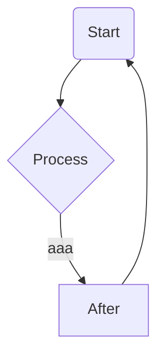
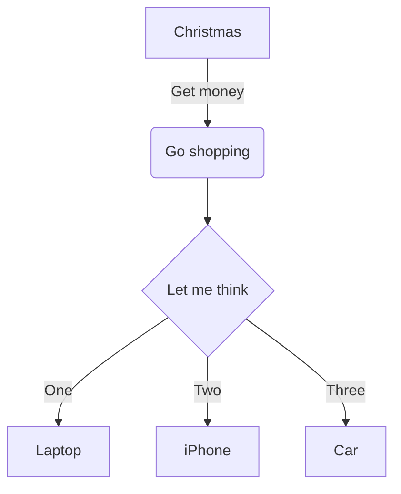
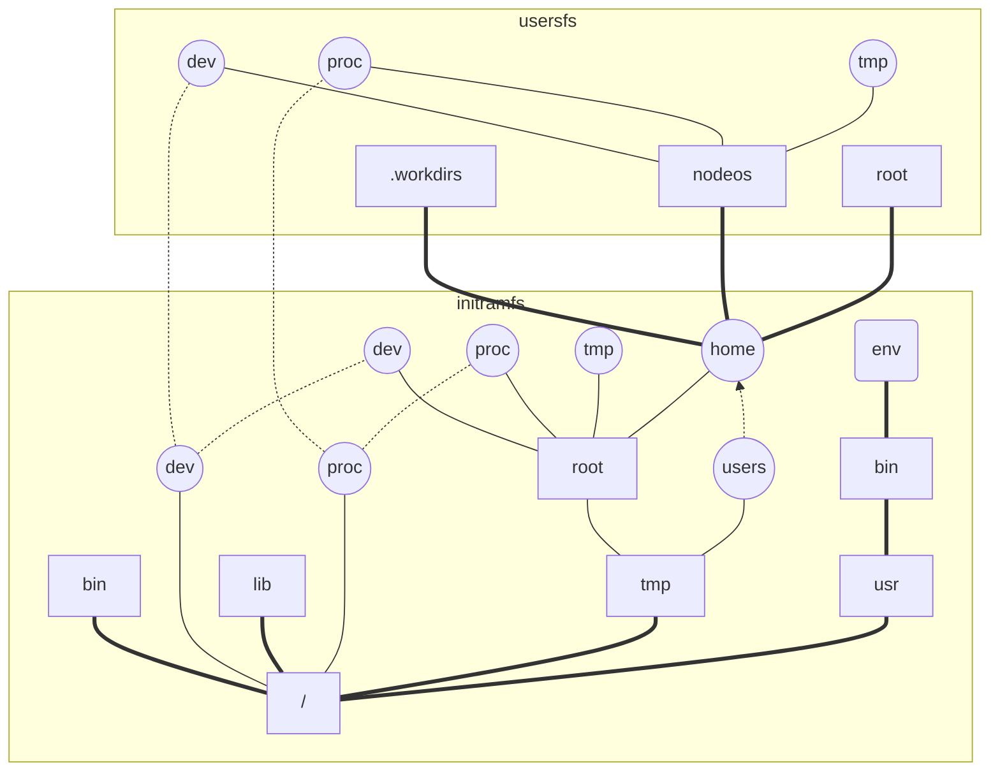
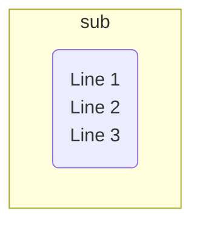
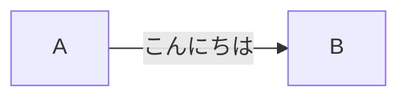
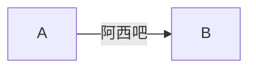
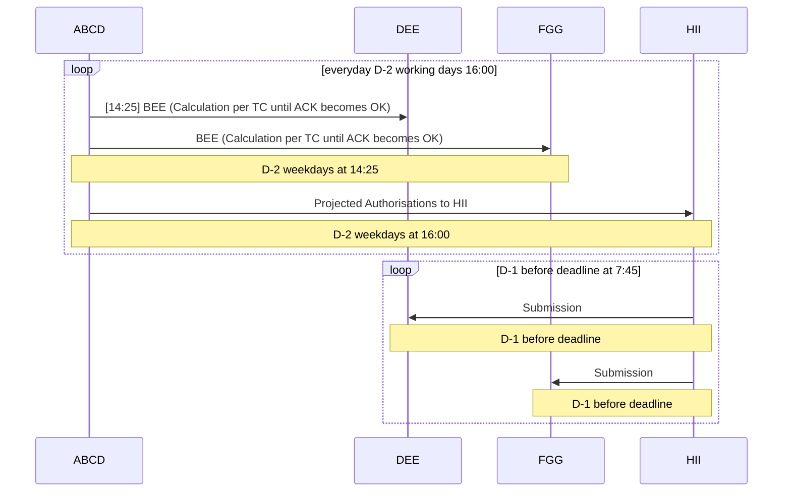
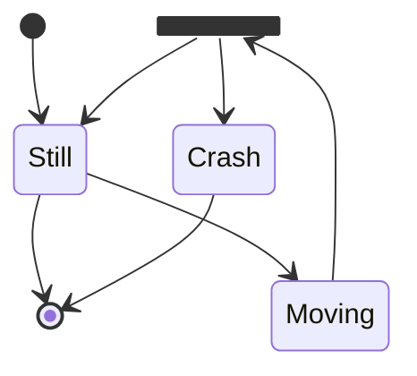

# mermaid graph test

```mermaid
graph TD
    A(Start) --> B{Process}
    B --aaa--> C[After]
    C --> A
```

```mermaid
graph TD
A[Christmas] -->|Get money| B(Go shopping)
B --> C{Let me think}
C -->|One| D[Laptop]
C -->|Two| E[iPhone]
C -->|Three| F[Car]
```

```mermaid
graph BT
  subgraph initramfs
    / === ibin[bin]
    / --- DEV((dev))
    / === ilib[lib]
    / --- proc((proc))
    / === tmp

    /   === usr
    usr === bin
    bin === ENV(env)

    tmp --- root
    tmp --- users((users))

    root --- RDEV((dev))
    root --- rproc((proc))
    root --- rtmp((tmp))

    root --- home((home))
  end

  subgraph usersfs
    .workdirs
    nodeos
    uroot[root]

    nodeos --- NDEV((dev))
    nodeos --- nproc((proc))
    nodeos --- ntmp((tmp))
  end

  home === .workdirs
  home === nodeos
  home === uroot

  users -.-> home

  DEV  -.- NDEV
  proc -.- nproc

  DEV  -.- RDEV
  proc -.- rproc
```

```mermaid
  graph TD
  subgraph sub
    node(Line 1<br>Line 2<br/>Line 3)
  end
```

```mermaid
  graph LR
    A -->|こんにちは| B
```

```mermaid
  graph LR
    A -->|阿西吧| B
```

```mermaid
sequenceDiagram
%% See https://mermaidjs.github.io/sequenceDiagram.html

loop everyday D-2 working days 16:00
    ABCD->>DEE: [14:25] BEE (Calculation per TC until ACK becomes OK)
    
    ABCD->>FGG: BEE (Calculation per TC until ACK becomes OK)
    Note over ABCD,FGG: D-2 weekdays at 14:25
    ABCD->>HII: Projected Authorisations to HII
    Note over ABCD,HII: D-2 weekdays at 16:00
end

loop D-1 before deadline at 7:45
    HII->>DEE: Submission
    Note over HII,DEE: D-1 before deadline
    HII->>FGG: Submission
    Note over HII,FGG: D-1 before deadline
end
```

```mermaid
stateDiagram
    state Choose <<fork>>
    [*] --> Still
    Still --> [*]

    Still --> Moving
    Moving --> Choose
    Choose --> Still
    Choose --> Crash
    Crash --> [*]
```
